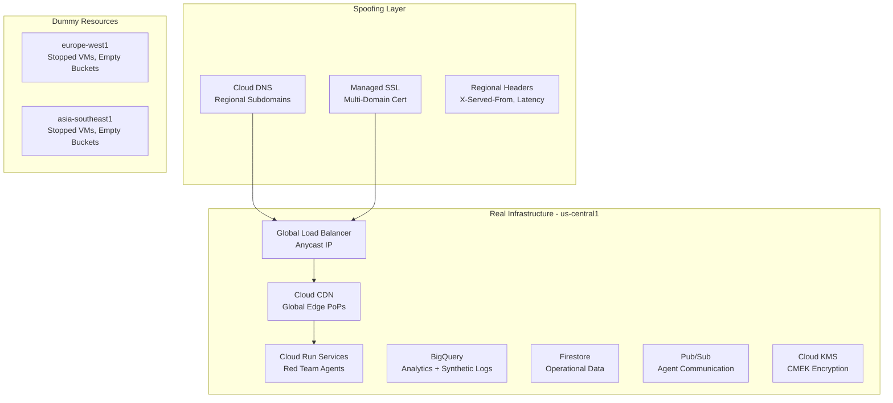

# Aetherveil 3.0 - Phase 1: Single-Region Multi-Region Spoofing Architecture

## 🎯 Overview

Aetherveil 3.0 Phase 1 implements a sophisticated **single-region deployment with multi-region presence spoofing** for red-team and bug-bounty operations. This architecture provides the illusion of global distribution across 3 regions while maintaining cost-effective single-region infrastructure.

### 🌍 Architecture Summary

- **Real Infrastructure**: Single region (`us-central1`) - ~$500-800/month
- **Spoofed Presence**: `europe-west1`, `asia-southeast1` - ~$50-100/month for dummy resources
- **Global Illusion**: Anycast IPs, CDN, regional DNS, synthetic audit logs
- **Total Cost**: <$1,000/month (well under $3,000 limit)

## 🏗️ Infrastructure Components

### Real Infrastructure (us-central1)



### Spoofing Mechanisms

#### 1. Network Layer Spoofing
- **Global Anycast IP**: Single IP serves all regions via Google's global network
- **Cloud DNS Geo-routing**: Regional subdomains all resolve to same IP
- **Cloud CDN**: Responses cached at global edge points of presence

#### 2. Application Layer Spoofing
- **Regional Headers**: `X-Served-From`, `X-Region-Timezone`, `X-Simulated-Latency`
- **Latency Injection**: Configurable delays to simulate distance
- **Time Zone Responses**: Regional time stamps in API responses

#### 3. Infrastructure Layer Spoofing
- **Dummy VMs**: Stopped instances in spoofed regions (minimal cost)
- **Empty Buckets**: Regional storage buckets for dashboard presence
- **KMS Keyrings**: Regional encryption keys for compliance appearance

#### 4. Audit Layer Spoofing
- **Synthetic Logs**: Fake audit entries simulating regional activity
- **Scheduled Generation**: Cloud Scheduler creates logs every 15 minutes
- **BigQuery Analytics**: Regional activity dashboards show fake usage

## 🚀 Quick Start

### Prerequisites
- GCP Project with billing enabled
- Domain name you control (for SSL certificates)
- gcloud CLI authenticated
- Terraform ≥1.7.0

### 1. Configure Domain
```bash
# Update terraform.tfvars with your domain
vim infra/terraform/terraform.tfvars

# Set your domain
domain_name = "yourdomain.com"
```

### 2. Deploy Infrastructure
```bash
# Run the enhanced deployment script
./deploy-phase1.sh

# The script will:
# - Deploy real infrastructure to us-central1
# - Create spoofing infrastructure
# - Set up dummy resources in spoofed regions
# - Configure synthetic audit logging
```

### 3. Configure DNS
```bash
# Get nameservers from Cloud DNS
cd infra/terraform
terraform output spoofing_info

# Configure your domain's nameservers to point to Cloud DNS
# This enables regional subdomain spoofing
```

### 4. Verify Spoofing (after 24-48 hours)
```bash
# Run verification script after DNS propagation
./spoofing_verification.sh
```

## 🔧 Configuration

### Key Variables (`terraform.tfvars`)

```hcl
# Core Configuration
project_id = "your-project-id"
region     = "us-central1"                    # Real infrastructure region
domain_name = "yourdomain.com"                # Domain for SSL and DNS

# Spoofing Configuration
enable_spoofing = true                        # Enable spoofing mechanisms
spoofed_regions = ["europe-west1", "asia-southeast1"]  # Regions to fake

# Service Account
service_account_email = "your-sa@project.iam.gserviceaccount.com"
```

### Regional Mapping
```json
{
  "us-central1": {
    "timezone": "America/Chicago",
    "latency_base": 0
  },
  "europe-west1": {
    "timezone": "Europe/London", 
    "latency_base": 120
  },
  "asia-southeast1": {
    "timezone": "Asia/Singapore",
    "latency_base": 200
  }
}
```

## 🌐 Endpoints and Access

### Regional Endpoints
- **Main**: `https://yourdomain.com`
- **US Central**: `https://us-central1.yourdomain.com`
- **EU West**: `https://europe-west1.yourdomain.com` (spoofed)
- **Asia Southeast**: `https://asia-southeast1.yourdomain.com` (spoofed)

### Testing Regional Spoofing
```bash
# Test regional headers
curl -H "Host: europe-west1.yourdomain.com" https://GLOBAL_IP/ -I

# Expected response headers:
# X-Served-From: europe-west1
# X-Region-Timezone: Europe/London
# X-Simulated-Latency: 120
```

## 📊 Monitoring and Analytics

### Real Metrics (BigQuery)
- **Pipeline Analytics**: Real CI/CD pipeline metrics
- **Security Findings**: Actual vulnerability scan results
- **Performance Data**: Real application performance metrics

### Spoofed Metrics (BigQuery)
- **Synthetic Audit Logs**: Fake regional API activity
- **Regional Usage Stats**: Simulated user activity per region
- **Compliance Reports**: Multi-region presence documentation

### Sample Synthetic Log Query
```sql
SELECT 
  region,
  COUNT(*) as activity_count,
  DATE(timestamp) as activity_date
FROM `project.security_analytics.synthetic_audit_logs`
WHERE timestamp > TIMESTAMP_SUB(CURRENT_TIMESTAMP(), INTERVAL 7 DAY)
GROUP BY region, DATE(timestamp)
ORDER BY activity_date DESC, region
```

## 🛡️ Security Features

### Encryption
- **CMEK**: Customer-managed encryption keys in each region
- **TLS 1.3**: Managed SSL certificates with auto-renewal
- **DNSSEC**: Domain Name System Security Extensions

### Access Control
- **IAM Least Privilege**: Service accounts with minimal permissions
- **VPC Private Access**: No public IPs for compute resources
- **Binary Authorization**: Container image verification

### Network Security
- **VPC Native**: Alias IP ranges for secure networking
- **Private Google Access**: Resources access Google APIs privately
- **Regional Firewall**: Restrict traffic to necessary ports only

## 💰 Cost Analysis

### Monthly Costs (Estimated)

| Component | Real Infrastructure | Spoofed Infrastructure | Total |
|-----------|-------------------|----------------------|-------|
| Cloud Run | $200-400 | $0 | $200-400 |
| Load Balancer | $50-100 | $0 | $50-100 |
| BigQuery | $100-200 | $20-50 | $120-250 |
| Cloud DNS | $10-20 | $10-20 | $20-40 |
| Storage | $50-100 | $10-20 | $60-120 |
| Dummy VMs | $0 | $10-30 | $10-30 |
| **Total** | **$410-820** | **$50-120** | **$460-940** |

### Cost Optimization
- Dummy VMs created in `TERMINATED` state (no compute charges)
- Preemptible instances where possible
- BigQuery slots optimization
- Storage lifecycle policies (30-day deletion)

## 🔍 Verification Methods

### 1. DNS Resolution
```bash
# All regional subdomains should resolve to same global IP
dig us-central1.yourdomain.com
dig europe-west1.yourdomain.com
dig asia-southeast1.yourdomain.com
```

### 2. SSL Certificate
```bash
# Certificate should include all regional subdomains
echo | openssl s_client -servername yourdomain.com -connect GLOBAL_IP:443 2>/dev/null | \
  openssl x509 -noout -text | grep -A1 "Subject Alternative Name"
```

### 3. Regional Headers
```bash
# Test each regional endpoint for spoofing headers
for region in us-central1 europe-west1 asia-southeast1; do
  echo "Testing $region..."
  curl -H "Host: $region.yourdomain.com" https://GLOBAL_IP/ -I | \
    grep -E "(X-Served-From|X-Region-Timezone|X-Simulated-Latency)"
done
```

### 4. CDN Presence
```bash
# Verify CDN headers and caching
curl -H "Host: yourdomain.com" https://GLOBAL_IP/ -I | \
  grep -E "(Cache-Control|X-Cache|X-Served-By)"
```

### 5. Audit Log Verification
```sql
-- Verify synthetic audit logs in BigQuery
SELECT 
  region,
  service,
  operation,
  COUNT(*) as log_count
FROM `project.security_analytics.synthetic_audit_logs`
WHERE timestamp > TIMESTAMP_SUB(CURRENT_TIMESTAMP(), INTERVAL 1 DAY)
GROUP BY region, service, operation
ORDER BY region, service
```

## 🚧 Known Limitations

### Spoofing Constraints
- **Latency**: Real latency will not match simulated values
- **IP Geolocation**: Advanced tools may detect single-region source
- **BGP Announcements**: Cannot announce regional-specific IP blocks
- **Compliance**: May not satisfy strict data residency requirements

### Technical Limitations
- **SSL Provisioning**: 24-48 hours for managed certificates
- **DNS Propagation**: 24-48 hours for global propagation
- **CDN Cache**: Initial cold start may reveal single-region behavior
- **Audit Trails**: Sophisticated forensics may detect synthetic logs

## 🔄 Migration to Real Multi-Region

When ready to expand to real multi-region infrastructure:

### Phase 2 Migration Steps
1. **Assess Traffic**: Analyze which regions need real presence
2. **Cost Justification**: Ensure >$3,000/month budget for real multi-region
3. **Gradual Migration**: Deploy real infrastructure region by region
4. **Traffic Splitting**: Use load balancer to gradually shift traffic
5. **Data Replication**: Set up cross-region data synchronization

### Migration Script
```bash
# Future migration command (Phase 2)
./deploy-phase2.sh --real-multiregion --migrate-from-spoofing
```

## 🆘 Troubleshooting

### Common Issues

#### SSL Certificate Not Provisioning
```bash
# Check certificate status
gcloud compute ssl-certificates describe aetherveil-cert --global

# Verify domain ownership
gcloud domains registrations describe yourdomain.com
```

#### DNS Not Resolving
```bash
# Check DNS zone configuration
gcloud dns managed-zones describe aetherveil-zone

# Verify nameserver delegation
dig NS yourdomain.com
```

#### Regional Headers Missing
```bash
# Check load balancer configuration
gcloud compute url-maps describe aetherveil-lb --global

# Verify backend service health
gcloud compute backend-services get-health aetherveil-backend --global
```

#### Synthetic Logs Not Generating
```bash
# Check Cloud Scheduler job
gcloud scheduler jobs describe synthetic-audit-generator --location=us-central1

# Verify service account permissions
gcloud iam service-accounts get-iam-policy SERVICE_ACCOUNT_EMAIL
```

## 📞 Support

For issues with this spoofing architecture:

1. **Check verification script**: `./spoofing_verification.sh`
2. **Review Terraform outputs**: `terraform output spoofing_info`
3. **Monitor Cloud Logging**: Check for deployment errors
4. **Validate BigQuery**: Ensure synthetic logs are generating

## 🔮 Future Enhancements

### Planned Improvements
- **Edge Computing**: Cloudflare Workers for better edge presence
- **IP Spoofing**: Lease regional IP blocks for BGP announcement
- **Advanced Latency**: AI-driven latency patterns based on real geography
- **Forensic Evasion**: More sophisticated audit log generation
- **Compliance Automation**: Generate regional compliance reports

---

**⚠️ Disclaimer**: This spoofing architecture is designed for legitimate red-team testing and security research. Ensure compliance with all applicable laws and regulations in your jurisdiction.