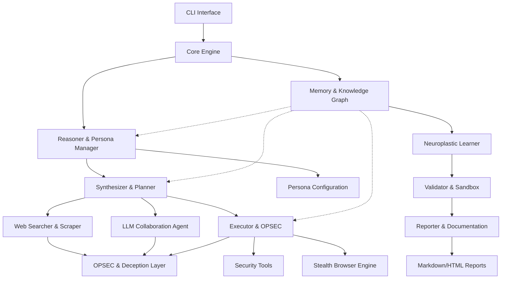

# Chimera: Neuroplastic Autonomous Red-Team Organism


Chimera is an advanced, autonomous, neuroplastic red-team organism designed for ethical bug bounty operations and security research. It combines character-driven decision making, adaptive learning, stealth capabilities, and collaborative intelligence to evolve its tactics based on outcomes and web intelligence.

## 🎯 Core Features

### 🧠 Neuroplastic Intelligence
- **Adaptive Learning**: Evolves tactics based on success/failure outcomes
- **Weighted Knowledge Graph**: Self-organizing memory that strengthens useful knowledge
- **Decision Trees**: Learns optimal decision patterns through experience
- **Temporal Decay**: Automatically prunes outdated or ineffective knowledge

### 👤 Character-Driven Personas
- **Configurable Personas**: Cautious, Balanced, Aggressive, Creative, Stealth-Focused
- **Risk Tolerance**: Influences tool selection and approach aggressiveness
- **Stealth Priority**: Balances speed vs. operational security
- **Collaboration Preference**: Determines when to seek LLM advice

### 🕵️ Advanced Stealth Capabilities
- **Browser Fingerprint Randomization**: Evades detection mechanisms
- **Human-like Behavior**: Realistic timing, scrolling, and interaction patterns
- **Traffic Blending**: Generates cover traffic and decoy requests
- **OPSEC-Aware**: Automatically adjusts based on detection risk

### 🤝 LLM Collaboration
- **Multi-Provider Support**: Claude, GPT-4, Gemini web interfaces
- **Tactical Advice**: Seeks expert guidance for complex decisions
- **Response Validation**: Filters and validates LLM suggestions
- **Contextual Queries**: Provides relevant context for better advice

### 🔧 Autonomous Operations
- **Self-Planning**: Creates comprehensive analysis strategies
- **Tool Integration**: Automated execution of security tools
- **Continuous Learning**: Discovers new techniques from web sources
- **Self-Validation**: Tests capabilities in sandboxed environments

## 🏗️ Architecture



## 🚀 Quick Start

### Prerequisites

- Python 3.8+
- ARM64 Ubuntu/Termux (optimized)
- Chrome/Chromium browser
- 2GB+ RAM
- 10GB+ disk space

### Installation

1. **Clone and Setup**:
```bash
git clone <repository-url>
cd chimera
python -m venv venv
source venv/bin/activate  # On Windows: venv\Scripts\activate
pip install -r requirements.txt
```

2. **Configure Environment**:
```bash
cp .env.example .env
# Edit .env with your configuration
```

3. **Initialize Chimera**:
```bash
python main.py status
```

### Basic Usage

#### Interactive Mode
```bash
python main.py interactive
```

Commands in interactive mode:
- `persona aggressive` - Switch to aggressive persona
- `learn web application security` - Learn about a topic
- `analyze example.com` - Analyze a target
- `status` - Show current status

#### Campaign Mode
```bash
python main.py campaign example.com --scope scope.json --persona balanced
```

#### Continuous Learning
```bash
python main.py learn
```

## 📋 Configuration

### Main Configuration (`config.yaml`)

```yaml
# Core Engine Settings
core:
  max_concurrent_tasks: 4
  task_timeout: 3600
  auto_save_interval: 300

# Persona Configuration
persona:
  default: "balanced"
  available_personas:
    - cautious
    - balanced  
    - aggressive
    - creative
    - stealth_focused

# Stealth and OPSEC
opsec:
  stealth_mode: true
  traffic_mixing: true
  ip_rotation: true
  fingerprint_randomization: true
```

### Environment Variables (`.env`)

```bash
# Core Configuration
CHIMERA_DEBUG=false
CHIMERA_LOG_LEVEL=INFO

# API Keys (optional)
OPENAI_API_KEY=your_key_here
ANTHROPIC_API_KEY=your_key_here

# Proxy Configuration
HTTP_PROXY=
SOCKS_PROXY=socks5://127.0.0.1:9050

# Security Settings
MAX_THREADS=4
REQUEST_DELAY_MIN=1.0
REQUEST_DELAY_MAX=5.0
```

## 🎭 Personas

### Cautious
- **Risk Tolerance**: 20%
- **Stealth Priority**: 90%
- **Best For**: High-value targets, compliance testing
- **Characteristics**: Conservative, thorough documentation, seeks collaboration

### Balanced  
- **Risk Tolerance**: 50%
- **Stealth Priority**: 60%
- **Best For**: General bug bounty, most scenarios
- **Characteristics**: Moderate approach, good coverage

### Aggressive
- **Risk Tolerance**: 80%
- **Stealth Priority**: 30%
- **Best For**: Time-constrained assessments, internal testing
- **Characteristics**: Fast, thorough, willing to use higher-risk tools

### Creative
- **Risk Tolerance**: 60%
- **Creativity Level**: 90%
- **Best For**: Novel vulnerability discovery, research
- **Characteristics**: Innovative approaches, seeks LLM collaboration

### Stealth-Focused
- **Risk Tolerance**: 10%
- **Stealth Priority**: 100%
- **Best For**: High-security environments, covert operations
- **Characteristics**: Minimal footprint, passive techniques only

## 🔧 Advanced Features

### Neuroplastic Learning

Chimera continuously adapts its knowledge and decision-making patterns:

- **Knowledge Graph**: Weighted network of security concepts, tools, and techniques
- **Outcome Learning**: Strengthens successful strategies, weakens failed approaches
- **Cross-Domain Transfer**: Applies learnings from one target type to others
- **Temporal Decay**: Automatically ages and prunes outdated knowledge

### Stealth Techniques

Multiple layers of detection evasion:

- **Browser Stealth**: User-agent rotation, fingerprint randomization, human timing
- **Network Stealth**: Proxy rotation, traffic shaping, cover requests
- **Behavioral Mimicry**: Realistic scrolling, clicking, and typing patterns
- **Request Patterns**: Intelligent rate limiting and timing variation

### LLM Integration

Collaborative intelligence with multiple LLM providers:

- **Contextual Queries**: Provides relevant target and technique context
- **Response Validation**: Filters dangerous or irrelevant suggestions
- **Multi-Provider Fallback**: Switches providers if one becomes unavailable
- **Learning Integration**: Incorporates LLM advice into knowledge graph

## 📊 Example Campaign

### Target: `example.com`
### Persona: `balanced`
### Scope: Standard web application

```json
{
  "domains": ["example.com", "*.example.com"],
  "exclusions": ["status.example.com"],
  "rules": {
    "max_requests_per_minute": 30,
    "allowed_techniques": ["scanning", "enumeration", "manual_testing"],
    "forbidden_techniques": ["dos", "data_modification"]
  }
}
```

### Generated Plan:
1. **Information Gathering** (30 min)
   - WHOIS lookup
   - DNS enumeration  
   - Search engine dorking
   - Social media analysis

2. **Active Reconnaissance** (45 min)
   - Port scanning
   - Service enumeration
   - Subdomain bruteforcing
   - Technology fingerprinting

3. **Vulnerability Assessment** (60 min)
   - Automated scanning
   - Manual testing
   - Configuration review
   - Common vulnerability checks

### Sample Report Output:

```markdown
# Security Assessment Report - example.com

## Executive Summary
Comprehensive security assessment identified 3 high-severity and 7 medium-severity vulnerabilities.

## Findings

### HIGH - SQL Injection in Login Form
- **Location**: `/login.php`
- **Impact**: Database access, potential data exfiltration
- **PoC**: `admin' OR '1'='1' --`
- **Remediation**: Use parameterized queries

### MEDIUM - Missing Security Headers
- **Location**: All pages
- **Impact**: XSS, clickjacking risk
- **Remediation**: Implement CSP, X-Frame-Options, HSTS

## Technical Details
[Detailed technical analysis...]

## Recommendations
[Prioritized remediation steps...]
```

## 🧪 Development

### Project Structure
```
chimera/
├── main.py                 # Entry point
├── config.yaml            # Configuration
├── requirements.txt        # Dependencies
├── chimera/               # Core package
│   ├── core/              # Engine & events
│   ├── reasoner/          # Decision making
│   ├── memory/            # Knowledge graph
│   ├── web/               # Web interaction
│   ├── llm/               # LLM collaboration
│   ├── planner/           # Strategy planning
│   ├── executor/          # Tool execution
│   ├── validator/         # Sandbox testing
│   └── reporter/          # Report generation
├── data/                  # Persistent data
└── tests/                 # Test suites
```

### Testing
```bash
# Run basic tests
python -m pytest tests/

# Test specific module
python -m pytest tests/test_reasoner.py -v

# Integration tests
python -m pytest tests/integration/ -v
```

### Contributing

1. Fork the repository
2. Create a feature branch
3. Implement changes with tests
4. Submit a pull request

## 🔒 Security & Ethics

### Responsible Use
- **Bug Bounty Only**: Designed for authorized testing programs
- **Scope Compliance**: Strictly respects defined scope boundaries
- **Rate Limiting**: Built-in protections against accidental DoS
- **No Data Modification**: Read-only operations by default

### Safety Features
- **Sandbox Validation**: Tests new capabilities safely
- **OPSEC Monitoring**: Detects and responds to potential exposure
- **Audit Logging**: Comprehensive activity tracking
- **Emergency Stop**: Immediate operation termination capability

### Legal Compliance
- Users responsible for ensuring legal authorization
- Includes scope validation and compliance checking
- Comprehensive logging for accountability
- No offensive capabilities included

## 🐛 Troubleshooting

### Common Issues

**Browser Not Starting**
```bash
# Install Chrome/Chromium
sudo apt install chromium-browser

# Check browser path
which chromium-browser
```

**Permission Errors**
```bash
# Fix data directory permissions
chmod -R 755 ./data/
```

**Memory Issues**
```bash
# Reduce concurrent tasks
# Edit config.yaml:
core:
  max_concurrent_tasks: 2
```

**Network Issues**
```bash
# Test connectivity
curl -I https://www.google.com

# Check proxy settings
echo $HTTP_PROXY
```

### Performance Optimization

- **ARM64**: Optimized for ARM64 processors
- **Memory Management**: Automatic knowledge graph pruning
- **Concurrent Operations**: Configurable thread limits
- **Caching**: Intelligent caching of search results

## 📖 Documentation

- [API Reference](docs/api.md)
- [Architecture Guide](docs/architecture.md)
- [Persona Development](docs/personas.md)
- [Integration Guide](docs/integration.md)
- [Troubleshooting](docs/troubleshooting.md)

## 🤝 Support

- **Issues**: [GitHub Issues](https://github.com/your-org/chimera/issues)
- **Discussions**: [GitHub Discussions](https://github.com/your-org/chimera/discussions)
- **Security**: security@your-org.com

## 📜 License

MIT License - see [LICENSE](LICENSE) file for details.

## 🙏 Acknowledgments

- OpenAI, Anthropic, Google for LLM collaboration capabilities
- Security research community for techniques and methodologies
- Bug bounty platforms for real-world testing opportunities
- Open source security tools integrated within Chimera

---

**⚠️ Disclaimer**: Chimera is designed for authorized security testing only. Users are responsible for ensuring proper authorization and legal compliance. The developers are not responsible for misuse of this tool.

**🎯 Mission**: Advancing cybersecurity through intelligent, adaptive, and ethical automated testing.