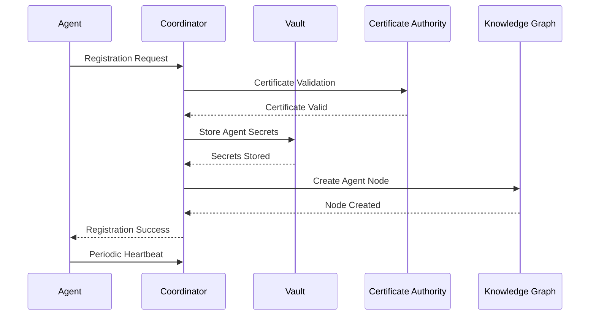
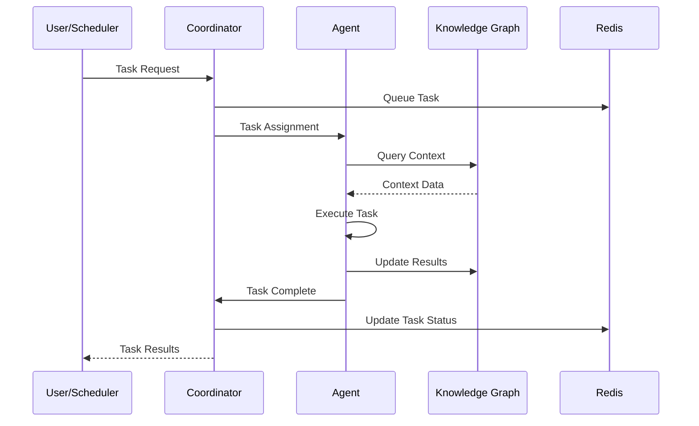
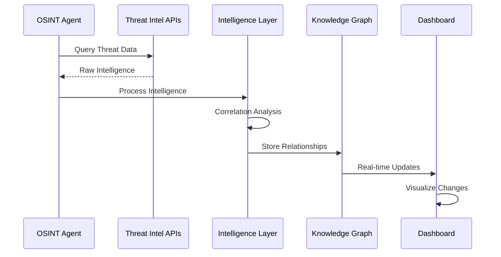

# Aetherveil Sentinel - Architecture Documentation

## Overview

The Aetherveil Sentinel is designed as a distributed, autonomous AI organism for advanced red team security operations. This document provides a comprehensive view of the system architecture, design decisions, and implementation details.

**Repository**: https://github.com/losa201/Aetherveil

## Table of Contents

1. [System Architecture](#system-architecture)
2. [Component Design](#component-design)
3. [Data Flow](#data-flow)
4. [Communication Protocols](#communication-protocols)
5. [Security Architecture](#security-architecture)
6. [Scalability and Performance](#scalability-and-performance)
7. [AI/ML Architecture](#aiml-architecture)
8. [Deployment Architecture](#deployment-architecture)
9. [Design Decisions](#design-decisions)
10. [Future Enhancements](#future-enhancements)

---

## System Architecture

### High-Level Architecture

The Aetherveil Sentinel follows a distributed microservices architecture with autonomous AI agents:

```
┌─────────────────────────────────────────────────────────────────────────────────────────────────────────────────────────────────┐
│                                                    Presentation Layer                                                              │
│                                                                                                                                     │
│  ┌─────────────────────────────────────────────────────────────────────────────────────────────────────────────────────────────┐  │
│  │                                         Web Dashboard (React + D3.js)                                                         │  │
│  │                                                                                                                                 │  │
│  │  ┌─────────────────┐  ┌─────────────────┐  ┌─────────────────┐  ┌─────────────────┐  ┌─────────────────┐                   │  │
│  │  │ Threat Intel    │  │ Graph Viz       │  │ Agent Mgmt      │  │ Reporting       │  │ System Monitor  │                   │  │
│  │  │ Dashboard       │  │ (D3.js)         │  │ Interface       │  │ Interface       │  │ Interface       │                   │  │
│  │  └─────────────────┘  └─────────────────┘  └─────────────────┘  └─────────────────┘  └─────────────────┘                   │  │
│  └─────────────────────────────────────────────────────────────────────────────────────────────────────────────────────────────┘  │
└─────────────────────────────────────────────────────────────────────────────────────────────────────────────────────────────────┘
                                                                    │
                                                                    │ HTTPS/WSS
                                                                    ▼
┌─────────────────────────────────────────────────────────────────────────────────────────────────────────────────────────────────┐
│                                                    API Gateway Layer                                                               │
│                                                                                                                                     │
│  ┌─────────────────────────────────────────────────────────────────────────────────────────────────────────────────────────────┐  │
│  │                                        Load Balancer + API Gateway                                                            │  │
│  │                                                                                                                                 │  │
│  │  ┌─────────────────┐  ┌─────────────────┐  ┌─────────────────┐  ┌─────────────────┐  ┌─────────────────┐                   │  │
│  │  │ Rate Limiting   │  │ Authentication  │  │ Authorization   │  │ SSL Termination │  │ Request Routing │                   │  │
│  │  └─────────────────┘  └─────────────────┘  └─────────────────┘  └─────────────────┘  └─────────────────┘                   │  │
│  └─────────────────────────────────────────────────────────────────────────────────────────────────────────────────────────────┘  │
└─────────────────────────────────────────────────────────────────────────────────────────────────────────────────────────────────┘
                                                                    │
                                                                    │ mTLS
                                                                    ▼
┌─────────────────────────────────────────────────────────────────────────────────────────────────────────────────────────────────┐
│                                                   Application Layer                                                                │
│                                                                                                                                     │
│  ┌─────────────────┐  ┌─────────────────┐  ┌─────────────────┐  ┌─────────────────┐  ┌─────────────────┐                      │
│  │   Coordinator   │  │  Agent Swarm    │  │ Knowledge Graph │  │ Intelligence    │  │ Report Engine   │                      │
│  │                 │  │                 │  │ Service         │  │ Layer           │  │                 │                      │
│  │ • Orchestration │  │ • Reconnaissance│  │                 │  │                 │  │ • LLM Reports   │                      │
│  │ • Task Mgmt     │  │ • Scanner       │  │ • Neo4j Graph   │  │ • Threat Intel  │  │ • Multi-format  │                      │
│  │ • Agent Mgmt    │  │ • OSINT         │  │ • Attack Paths  │  │ • Analytics     │  │ • Scheduling    │                      │
│  │ • RL Training   │  │ • Stealth       │  │ • Risk Analysis │  │ • Correlation   │  │ • Templates     │                      │
│  │ • Load Balance  │  │ • Exploiter     │  │ • Visualization │  │ • AI/ML Models  │  │ • Distribution  │                      │
│  │ • Health Checks │  │ • RL Agent      │  │ • Query Engine  │  │ • Streaming     │  │ • Audit Trail   │                      │
│  └─────────────────┘  └─────────────────┘  └─────────────────┘  └─────────────────┘  └─────────────────┘                      │
│                                                                                                                                     │
└─────────────────────────────────────────────────────────────────────────────────────────────────────────────────────────────────┘
                                                                    │
                                                                    │ Encrypted
                                                                    ▼
┌─────────────────────────────────────────────────────────────────────────────────────────────────────────────────────────────────┐
│                                                    Data Layer                                                                      │
│                                                                                                                                     │
│  ┌─────────────────┐  ┌─────────────────┐  ┌─────────────────┐  ┌─────────────────┐  ┌─────────────────┐                      │
│  │     Redis       │  │     Neo4j       │  │   PostgreSQL    │  │   File Storage  │  │   Monitoring    │                      │
│  │                 │  │                 │  │                 │  │                 │  │                 │                      │
│  │ • Caching       │  │ • Graph DB      │  │ • User Data     │  │ • Reports       │  │ • Prometheus    │                      │
│  │ • Sessions      │  │ • Threat Intel  │  │ • Config Data   │  │ • Logs          │  │ • Grafana       │                      │
│  │ • Pub/Sub       │  │ • Relationships │  │ • Audit Logs    │  │ • Backups       │  │ • Alerting      │                      │
│  │ • Task Queues   │  │ • Analytics     │  │ • Metadata      │  │ • Artifacts     │  │ • Metrics       │                      │
│  │ • Rate Limiting │  │ • Cypher API    │  │ • Transactions  │  │ • Templates     │  │ • Dashboards    │                      │
│  └─────────────────┘  └─────────────────┘  └─────────────────┘  └─────────────────┘  └─────────────────┘                      │
└─────────────────────────────────────────────────────────────────────────────────────────────────────────────────────────────────┘
                                                                    │
                                                                    │ Encrypted
                                                                    ▼
┌─────────────────────────────────────────────────────────────────────────────────────────────────────────────────────────────────┐
│                                                Security & Secrets Layer                                                           │
│                                                                                                                                     │
│  ┌─────────────────┐  ┌─────────────────┐  ┌─────────────────┐  ┌─────────────────┐  ┌─────────────────┐                      │
│  │  HashiCorp      │  │  Certificate    │  │  TPM/HSM        │  │  Anti-Forensics │  │  Audit System   │                      │
│  │  Vault          │  │  Authority      │  │  Integration    │  │  Module         │  │                 │                      │
│  │                 │  │                 │  │                 │  │                 │  │                 │                      │
│  │ • API Keys      │  │ • mTLS Certs    │  │ • Secure Keys   │  │ • Memory Wipe   │  │ • Compliance    │                      │
│  │ • Secrets       │  │ • Root CA       │  │ • Attestation   │  │ • Artifact      │  │ • Forensics     │                      │
│  │ • Encryption    │  │ • Rotation      │  │ • Sealed Keys   │  │   Cleanup       │  │ • Tamper        │                      │
│  │ • Rotation      │  │ • Revocation    │  │ • Hardware RNG  │  │ • Secure Delete │  │   Detection     │                      │
│  │ • Policies      │  │ • OCSP          │  │ • Crypto Ops    │  │ • Steganography │  │ • Chain of      │                      │
│  │ • Audit Trail   │  │ • Validation    │  │ • Remote Attest │  │ • Obfuscation   │  │   Custody       │                      │
│  └─────────────────┘  └─────────────────┘  └─────────────────┘  └─────────────────┘  └─────────────────┘                      │
└─────────────────────────────────────────────────────────────────────────────────────────────────────────────────────────────────┘
```

### Core Design Principles

1. **Autonomous Operation**: Self-managing agents with minimal human intervention
2. **Distributed Architecture**: Fault-tolerant, scalable microservices
3. **Security by Design**: Zero-trust architecture with defense-in-depth
4. **AI-First Approach**: Machine learning and AI integrated throughout
5. **Real-time Processing**: Streaming data processing and analysis
6. **Elastic Scalability**: Auto-scaling based on demand and workload

---

## Component Design

### 1. Coordinator Service

**Purpose**: Central orchestration hub for the entire system

**Key Responsibilities**:
- Agent lifecycle management and health monitoring
- Task scheduling and workload distribution
- Resource allocation and optimization
- Security policy enforcement
- Performance monitoring and analytics

**Architecture**:
```python
class AetherVeilCoordinator:
    def __init__(self):
        self.agent_manager = AgentManager()
        self.task_scheduler = TaskScheduler()
        self.security_manager = SecurityManager()
        self.rl_trainer = RLTrainer()
        self.health_monitor = HealthMonitor()
        self.load_balancer = LoadBalancer()
```

**Key Features**:
- **Agent Registration**: Secure agent onboarding with certificate verification
- **Task Orchestration**: Intelligent task distribution based on agent capabilities
- **Load Balancing**: Dynamic load distribution across available agents
- **Health Monitoring**: Real-time agent health checks and failover
- **Security Enforcement**: Policy-based security control enforcement

### 2. Agent Swarm

**Purpose**: Autonomous security agents performing specialized tasks

#### Reconnaissance Agent
- **Function**: Network discovery and asset identification
- **Technologies**: Nmap, Masscan, custom scanners
- **Capabilities**: Port scanning, service enumeration, topology mapping
- **AI Integration**: Adaptive scanning strategies based on target behavior

#### Scanner Agent
- **Function**: Vulnerability assessment and security scanning
- **Technologies**: Nuclei, custom vulnerability checks
- **Capabilities**: CVE detection, configuration analysis, compliance checking
- **AI Integration**: Machine learning-based vulnerability prioritization

#### OSINT Agent
- **Function**: Open source intelligence gathering
- **Technologies**: Shodan, Censys, social media APIs
- **Capabilities**: Threat intelligence, reputation analysis, breach data correlation
- **AI Integration**: Natural language processing for intelligence analysis

#### Stealth Agent
- **Function**: Evasion and operational security
- **Technologies**: Tor, proxy chains, traffic obfuscation
- **Capabilities**: Behavioral mimicry, honeypot detection, anti-forensics
- **AI Integration**: Reinforcement learning for evasion strategy optimization

#### Exploiter Agent
- **Function**: Controlled exploitation testing
- **Technologies**: Metasploit, custom exploits
- **Capabilities**: Proof-of-concept exploitation, privilege escalation
- **AI Integration**: Safe exploitation with AI-powered safety checks

#### RL Agent
- **Function**: Continuous learning and optimization
- **Technologies**: PyTorch, TensorFlow, custom RL algorithms
- **Capabilities**: Strategy learning, performance optimization, adaptation
- **AI Integration**: Meta-learning and self-improvement algorithms

### 3. Knowledge Graph Service

**Purpose**: Centralized threat intelligence and relationship management

**Technology Stack**:
- **Database**: Neo4j Graph Database
- **Query Engine**: Cypher query language
- **Analytics**: Graph algorithms and centrality metrics
- **Visualization**: D3.js integration for real-time visualization

**Data Model**:
```cypher
// Example graph schema
(:Asset)-[:HOSTS]->(:Service)
(:Service)-[:HAS_VULNERABILITY]->(:Vulnerability)
(:Vulnerability)-[:EXPLOITED_BY]->(:ThreatActor)
(:ThreatActor)-[:USES]->(:Technique)
(:Technique)-[:TARGETS]->(:Asset)
```

### 4. Intelligence Layer

**Purpose**: Advanced threat analysis and correlation

**Components**:
- **Threat Intelligence Aggregator**: Multi-source intelligence collection
- **Correlation Engine**: Pattern matching and relationship discovery
- **Risk Assessment**: Dynamic risk scoring and prioritization
- **Behavioral Analytics**: Anomaly detection and behavioral analysis
- **Predictive Modeling**: Machine learning-based threat prediction

### 5. Report Engine

**Purpose**: Automated report generation and distribution

**Features**:
- **Multi-format Output**: PDF, HTML, JSON, XML
- **Template System**: Customizable report templates
- **LLM Integration**: AI-powered report generation
- **Scheduled Reports**: Automated periodic reporting
- **Distribution**: Multi-channel report delivery

---

## Data Flow

### Agent Registration Flow



### Task Execution Flow



### Threat Intelligence Flow



---

## Communication Protocols

### Inter-Service Communication

#### gRPC for High-Performance Services
```protobuf
service CoordinatorService {
  rpc RegisterAgent(AgentRegistration) returns (RegistrationResponse);
  rpc GetTasks(TaskRequest) returns (stream Task);
  rpc ReportStatus(AgentStatus) returns (StatusResponse);
}

service AgentService {
  rpc ExecuteTask(Task) returns (TaskResult);
  rpc GetHealth(HealthRequest) returns (HealthResponse);
  rpc UpdateConfiguration(ConfigUpdate) returns (ConfigResponse);
}
```

#### WebSocket for Real-time Updates
```javascript
// Dashboard WebSocket connection
const socket = io('wss://aetherveil.domain.com', {
  auth: {
    token: jwt_token
  }
});

socket.on('threat_detected', (data) => {
  updateThreatVisualization(data);
});

socket.on('agent_status', (data) => {
  updateAgentStatus(data);
});
```

#### Message Queue for Asynchronous Processing
```python
# Redis Pub/Sub for event distribution
class EventManager:
    def __init__(self):
        self.redis_client = redis.Redis()
        
    def publish_event(self, event_type: str, data: dict):
        self.redis_client.publish(f"aetherveil.{event_type}", json.dumps(data))
        
    def subscribe_to_events(self, event_types: List[str]):
        pubsub = self.redis_client.pubsub()
        for event_type in event_types:
            pubsub.subscribe(f"aetherveil.{event_type}")
```

### Security Protocols

#### mTLS Configuration
```yaml
# mTLS configuration
tls:
  enabled: true
  mutual_auth: true
  ca_cert: /certs/ca.pem
  cert: /certs/service.pem
  key: /certs/service-key.pem
  verify_client: true
  cipher_suites:
    - TLS_ECDHE_RSA_WITH_AES_256_GCM_SHA384
    - TLS_ECDHE_RSA_WITH_CHACHA20_POLY1305
```

#### JWT Token Format
```json
{
  "header": {
    "alg": "RS256",
    "typ": "JWT"
  },
  "payload": {
    "sub": "user@domain.com",
    "iat": 1645123456,
    "exp": 1645127056,
    "roles": ["operator", "analyst"],
    "permissions": ["read:threats", "write:reports"]
  }
}
```

---

## Security Architecture

### Zero Trust Architecture

#### Principles
1. **Never Trust, Always Verify**: Every request is authenticated and authorized
2. **Least Privilege Access**: Minimal required permissions for each component
3. **Microsegmentation**: Network and application-level segmentation
4. **Continuous Monitoring**: Real-time security monitoring and analysis

#### Implementation
```python
class ZeroTrustGateway:
    def __init__(self):
        self.auth_service = AuthenticationService()
        self.authz_service = AuthorizationService()
        self.policy_engine = PolicyEngine()
        
    def validate_request(self, request: Request) -> bool:
        # Authenticate the request
        identity = self.auth_service.authenticate(request)
        
        # Authorize based on policies
        authorized = self.authz_service.authorize(identity, request)
        
        # Apply dynamic policies
        policy_decision = self.policy_engine.evaluate(request, identity)
        
        return authorized and policy_decision
```

### Encryption Architecture

#### Data at Rest
- **Algorithm**: AES-256-GCM
- **Key Management**: HashiCorp Vault with HSM integration
- **Key Rotation**: Automatic 90-day rotation
- **Backup Encryption**: Separate encryption keys for backups

#### Data in Transit
- **Protocol**: TLS 1.3 with perfect forward secrecy
- **Cipher Suites**: ECDHE-RSA-AES256-GCM-SHA384
- **Certificate Management**: Automated certificate lifecycle
- **mTLS**: Mutual authentication for service-to-service communication

#### Application-Level Encryption
```python
class EncryptionService:
    def __init__(self):
        self.vault_client = VaultClient()
        self.key_cache = TTLCache(maxsize=1000, ttl=3600)
        
    def encrypt_sensitive_data(self, data: bytes, context: str) -> bytes:
        key = self.get_encryption_key(context)
        cipher = AES.new(key, AES.MODE_GCM)
        ciphertext, tag = cipher.encrypt_and_digest(data)
        return cipher.nonce + tag + ciphertext
        
    def decrypt_sensitive_data(self, encrypted_data: bytes, context: str) -> bytes:
        key = self.get_encryption_key(context)
        nonce, tag, ciphertext = encrypted_data[:16], encrypted_data[16:32], encrypted_data[32:]
        cipher = AES.new(key, AES.MODE_GCM, nonce=nonce)
        return cipher.decrypt_and_verify(ciphertext, tag)
```

---

## Scalability and Performance

### Horizontal Scaling Architecture

#### Auto-scaling Configuration
```yaml
# Kubernetes HPA configuration
apiVersion: autoscaling/v2
kind: HorizontalPodAutoscaler
metadata:
  name: aetherveil-coordinator-hpa
spec:
  scaleTargetRef:
    apiVersion: apps/v1
    kind: Deployment
    name: aetherveil-coordinator
  minReplicas: 3
  maxReplicas: 50
  metrics:
  - type: Resource
    resource:
      name: cpu
      target:
        type: Utilization
        averageUtilization: 70
  - type: Resource
    resource:
      name: memory
      target:
        type: Utilization
        averageUtilization: 80
  - type: Pods
    pods:
      metric:
        name: queue_depth
      target:
        type: AverageValue
        averageValue: "10"
```

### Performance Optimization

#### Caching Strategy
```python
class CachingStrategy:
    def __init__(self):
        self.redis_client = redis.Redis()
        self.local_cache = TTLCache(maxsize=10000, ttl=300)
        
    def get_cached_data(self, key: str) -> Optional[dict]:
        # L1 Cache: Local memory
        if key in self.local_cache:
            return self.local_cache[key]
            
        # L2 Cache: Redis
        data = self.redis_client.get(key)
        if data:
            parsed_data = json.loads(data)
            self.local_cache[key] = parsed_data
            return parsed_data
            
        return None
```

#### Database Optimization
```python
class DatabaseOptimizer:
    def __init__(self):
        self.connection_pool = ConnectionPool(
            max_connections=100,
            min_connections=10,
            connection_timeout=30
        )
        
    def optimize_queries(self):
        # Neo4j query optimization
        queries = [
            "CREATE INDEX node_type_index IF NOT EXISTS FOR (n:Node) ON (n.type)",
            "CREATE INDEX risk_score_index IF NOT EXISTS FOR (n:Node) ON (n.risk_score)",
            "CREATE INDEX timestamp_index IF NOT EXISTS FOR (r:Relationship) ON (r.timestamp)"
        ]
        
        for query in queries:
            self.execute_query(query)
```

---

## AI/ML Architecture

### Machine Learning Pipeline

#### Training Pipeline
```python
class MLPipeline:
    def __init__(self):
        self.data_processor = DataProcessor()
        self.feature_extractor = FeatureExtractor()
        self.model_trainer = ModelTrainer()
        self.model_evaluator = ModelEvaluator()
        
    def train_threat_detection_model(self, training_data: pd.DataFrame):
        # Data preprocessing
        processed_data = self.data_processor.preprocess(training_data)
        
        # Feature extraction
        features = self.feature_extractor.extract_features(processed_data)
        
        # Model training
        model = self.model_trainer.train_model(features)
        
        # Model evaluation
        metrics = self.model_evaluator.evaluate(model, features)
        
        return model, metrics
```

#### Reinforcement Learning Architecture
```python
class RLAgent:
    def __init__(self):
        self.policy_network = PolicyNetwork()
        self.value_network = ValueNetwork()
        self.experience_buffer = ExperienceBuffer()
        self.meta_learner = MetaLearner()
        
    def train_step(self, state: State, action: Action, reward: float, next_state: State):
        # Store experience
        self.experience_buffer.add(state, action, reward, next_state)
        
        # Update policy and value networks
        if len(self.experience_buffer) > self.batch_size:
            batch = self.experience_buffer.sample(self.batch_size)
            self.update_networks(batch)
            
        # Meta-learning update
        self.meta_learner.update(state, action, reward, next_state)
```

### AI Integration Points

#### Threat Detection
```python
class ThreatDetector:
    def __init__(self):
        self.anomaly_detector = AnomalyDetector()
        self.pattern_recognizer = PatternRecognizer()
        self.risk_assessor = RiskAssessor()
        
    def detect_threats(self, network_data: Dict[str, Any]) -> List[Threat]:
        # Anomaly detection
        anomalies = self.anomaly_detector.detect(network_data)
        
        # Pattern recognition
        patterns = self.pattern_recognizer.recognize(network_data)
        
        # Risk assessment
        risks = self.risk_assessor.assess(anomalies, patterns)
        
        return self.consolidate_threats(risks)
```

---

## Deployment Architecture

### Cloud-Native Deployment

#### GCP Cloud Run Configuration
```yaml
apiVersion: serving.knative.dev/v1
kind: Service
metadata:
  name: aetherveil-coordinator
  annotations:
    run.googleapis.com/ingress: all
    run.googleapis.com/execution-environment: gen2
spec:
  template:
    metadata:
      annotations:
        autoscaling.knative.dev/minScale: "3"
        autoscaling.knative.dev/maxScale: "100"
        run.googleapis.com/cpu-boost: "true"
        run.googleapis.com/memory: "4Gi"
        run.googleapis.com/cpu: "2"
    spec:
      containerConcurrency: 80
      timeoutSeconds: 3600
      containers:
      - image: gcr.io/project-id/aetherveil-coordinator:latest
        ports:
        - containerPort: 8080
        env:
        - name: ENVIRONMENT
          value: "production"
        resources:
          requests:
            memory: "2Gi"
            cpu: "1"
          limits:
            memory: "4Gi"
            cpu: "2"
```

#### Kubernetes Deployment
```yaml
apiVersion: apps/v1
kind: Deployment
metadata:
  name: aetherveil-coordinator
  labels:
    app: aetherveil-coordinator
spec:
  replicas: 3
  selector:
    matchLabels:
      app: aetherveil-coordinator
  template:
    metadata:
      labels:
        app: aetherveil-coordinator
    spec:
      containers:
      - name: coordinator
        image: aetherveil/coordinator:latest
        ports:
        - containerPort: 8080
        - containerPort: 50051
        env:
        - name: REDIS_URL
          valueFrom:
            secretKeyRef:
              name: aetherveil-secrets
              key: redis-url
        resources:
          requests:
            memory: "1Gi"
            cpu: "500m"
          limits:
            memory: "2Gi"
            cpu: "1000m"
        livenessProbe:
          httpGet:
            path: /health
            port: 8080
          initialDelaySeconds: 30
          periodSeconds: 10
        readinessProbe:
          httpGet:
            path: /ready
            port: 8080
          initialDelaySeconds: 5
          periodSeconds: 5
```

### Edge Deployment

#### Edge Computing Architecture
```python
class EdgeDeployment:
    def __init__(self):
        self.edge_nodes = []
        self.central_coordinator = CentralCoordinator()
        
    def deploy_edge_agent(self, node_id: str, capabilities: List[str]):
        edge_agent = EdgeAgent(
            node_id=node_id,
            capabilities=capabilities,
            central_coordinator=self.central_coordinator
        )
        
        # Deploy with resource constraints
        edge_agent.deploy_with_constraints(
            max_memory="512Mi",
            max_cpu="250m",
            max_storage="2Gi"
        )
        
        self.edge_nodes.append(edge_agent)
```

---

## Design Decisions

### Architectural Decisions

#### ADR-001: Microservices Architecture
- **Status**: Accepted
- **Decision**: Adopt microservices architecture for scalability and maintainability
- **Rationale**: Enables independent scaling, technology diversity, and fault isolation
- **Consequences**: Increased complexity, network latency, distributed system challenges

#### ADR-002: Graph Database for Threat Intelligence
- **Status**: Accepted
- **Decision**: Use Neo4j for storing threat intelligence relationships
- **Rationale**: Natural representation of threat relationships, powerful graph queries
- **Consequences**: Additional complexity, specialized knowledge required

#### ADR-003: gRPC for Inter-Service Communication
- **Status**: Accepted
- **Decision**: Use gRPC for high-performance service-to-service communication
- **Rationale**: Type safety, performance, streaming capabilities
- **Consequences**: Protocol complexity, debugging challenges

#### ADR-004: JWT for Authentication
- **Status**: Accepted
- **Decision**: Use JWT tokens for authentication and authorization
- **Rationale**: Stateless, scalable, industry standard
- **Consequences**: Token management complexity, security considerations

#### ADR-005: Reinforcement Learning for Agent Optimization
- **Status**: Accepted
- **Decision**: Implement RL for autonomous agent improvement
- **Rationale**: Adaptive behavior, continuous learning, optimization
- **Consequences**: Complexity, training requirements, interpretability challenges

### Technology Stack Decisions

#### Backend Technology
- **Language**: Python 3.11+ (async/await, type hints, performance)
- **Framework**: FastAPI (performance, automatic documentation, type safety)
- **Database**: Neo4j (graph), Redis (cache), PostgreSQL (relational)
- **Message Queue**: Redis Pub/Sub (simplicity, performance)
- **AI/ML**: PyTorch (flexibility), scikit-learn (traditional ML)

#### Frontend Technology
- **Framework**: React 18 (component-based, ecosystem)
- **Visualization**: D3.js (flexibility, customization)
- **State Management**: Redux Toolkit (predictable state management)
- **Real-time**: Socket.IO (WebSocket abstraction, fallbacks)
- **Styling**: Tailwind CSS (utility-first, consistency)

#### Infrastructure
- **Containerization**: Docker (consistency, isolation)
- **Orchestration**: Kubernetes (scalability, management)
- **Cloud Platform**: GCP (integrated services, security)
- **Monitoring**: Prometheus + Grafana (metrics, alerting)
- **Secrets Management**: HashiCorp Vault (security, compliance)

---

## Future Enhancements

### Planned Features

#### Phase 1: Enhanced AI Capabilities
- **Advanced NLP**: Better threat intelligence analysis
- **Computer Vision**: Visual threat detection and analysis
- **Federated Learning**: Distributed model training
- **Explainable AI**: Interpretable threat detection decisions

#### Phase 2: Advanced Security Features
- **Quantum-Safe Cryptography**: Post-quantum cryptographic algorithms
- **Hardware Security Modules**: Enhanced key protection
- **Secure Enclaves**: Trusted execution environments
- **Blockchain Integration**: Immutable audit trails

#### Phase 3: Extended Integrations
- **SOAR Platforms**: Security orchestration integration
- **Threat Intelligence Feeds**: Additional commercial feeds
- **Cloud Security Posture**: Multi-cloud security assessment
- **IoT Security**: Internet of Things security monitoring

#### Phase 4: Advanced Analytics
- **Predictive Analytics**: Threat forecasting and prediction
- **Behavioral Analytics**: User and entity behavior analysis
- **Threat Hunting**: AI-powered threat hunting capabilities
- **Risk Quantification**: Business risk impact assessment

### Technical Debt and Improvements

#### Performance Optimizations
- **Database Sharding**: Horizontal database scaling
- **Caching Optimization**: Multi-level caching strategies
- **Query Optimization**: Database query performance tuning
- **Asynchronous Processing**: Improved async operation handling

#### Security Enhancements
- **Zero-Trust Networking**: Enhanced network segmentation
- **Runtime Security**: Container and application runtime protection
- **Threat Modeling**: Continuous threat model updates
- **Compliance Automation**: Automated compliance checking

#### Operational Improvements
- **GitOps Deployment**: Infrastructure as code with Git workflows
- **Chaos Engineering**: Resilience testing and improvement
- **Disaster Recovery**: Enhanced backup and recovery capabilities
- **Multi-Region Deployment**: Geographic distribution and failover

---

## Conclusion

The Aetherveil Sentinel architecture represents a modern, cloud-native approach to autonomous security operations. The design emphasizes scalability, security, and AI-driven capabilities while maintaining operational simplicity and maintainability.

Key architectural strengths:
- **Distributed and Resilient**: Microservices architecture with fault tolerance
- **AI-Powered**: Integrated machine learning and reinforcement learning
- **Secure by Design**: Zero-trust architecture with comprehensive security controls
- **Scalable and Performant**: Cloud-native design with auto-scaling capabilities
- **Extensible and Maintainable**: Modular design with clear separation of concerns

The architecture continues to evolve based on operational experience, security requirements, and emerging threats. Regular architectural reviews and updates ensure the system remains effective and secure in the face of evolving cyber threats.

For the most current version of this architecture, please refer to the official repository at https://github.com/losa201/Aetherveil.

*This architecture documentation is maintained as a living document and is updated regularly to reflect system changes and improvements.*